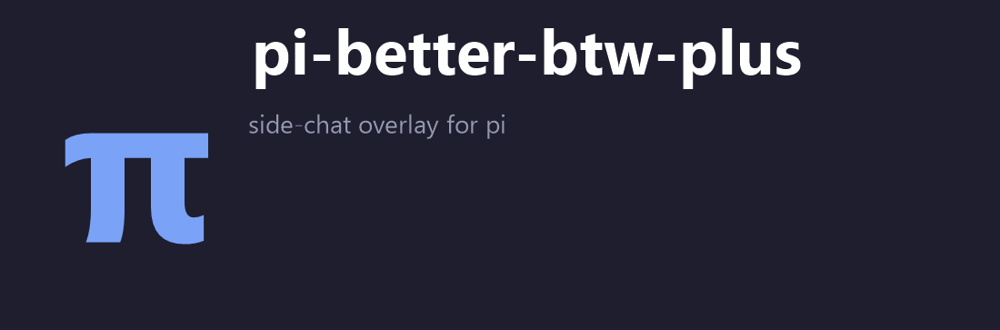

<p>
  
</p>

# @yceachan/pi-better-btw

**English | [简体中文](README.zh-CN.md)**

> [!note]
>
> This package is a maintained fork of [nicobailon/pi-side-chat](https://github.com/nicobailon/pi-side-chat) — original author **Nico Bailon**; extended by **yceachan** and maintained in [ea-pi-extensions](https://github.com/yceachan/ea-pi-extensions).

## TL;DR

**Fork the current conversation into a side chat (`btw`) while the main agent keeps working.**

[](https://www.npmjs.com/package/@yceachan/pi-better-btw)
[](LICENSE)

```bash
pi install npm:@yceachan/pi-better-btw
# in pi tui
> /btw  || or Alt+W
```

You're in the middle of a longer task and want to ask something small without derailing the main thread — check an API detail, sanity-check an approach, search something, or peek at what the main agent is doing. Open the btw TUI overlay, ask, close it. The main thread never gets interrupted.


## Feat

> [!note]
>
> **That's Why It's Called Better-Btw**
>
> The author tried [nicobailon/pi-side-chat](https://github.com/nicobailon/pi-side-chat) and [dbachelder/pi-btw](https://github.com/dbachelder/pi-btw) — both are simple forks from the main lane: when the agent is on turn, both tend to try to advance the main line. See [feat request: btw aside-session self-cognition — the side chat must not continue the main session's work · Issue #5 · nicobailon/pi-side-chat](https://github.com/nicobailon/pi-side-chat/issues/5).
>
> Hence the following features were carefully developed:

- `Aside-Agent self-Cognition`: injects the main-lane context so you can ask a btw question about the project's main line. Careful context engineering strengthens the side agent's cognition and keeps the full main-lane context's tool-call traces from polluting it or competing with the main lane to advance the project. The shared main-lane prefix is preserved for good cache hits.

- `Prompt pack`: every injected prompt is documented, with three-level overrides — `bundle` / `$PI_HOME` / `$CWD`.

- `TUI scroll, select, copy`: subscribes to mouse/hotkey events in the TUI overlay for scrolling, text selection, and `Ctrl+C` copy.

- `Readonly/Edit Mode`: read-only by default to answer btw questions; if you want the agent to make small edits along the way, `Ctrl+T` switches to edit mode.

  - ToolAllowList: bundle + config.json custom

  | Mode | Tools |
  | ---- | ---- |
  | Read-only | `read`, `grep`, `find`, `ls`; `peek_main`; `config.json.readOnlyExtensionAllowlist` |
  | Edit | `read`, `bash`, `edit`, `write` |

## Usage

Open the side chat with `/btw` (alias `/side`) or `Alt+W` (which also toggles background/display). Ask a question and press `Enter`.

Press `Esc` to close it. Reopen with `/btw` or `Alt+W` to continue where you left off.

| Shortcut | Action |
| -------- | ------ |
| `Alt+W` | Open (when closed) / background (when visible) / restore (when hidden) |
| `Ctrl+T` | Toggle read-only / edit mode |
| `Alt+R` | Re-fork from the latest main context |
| `Alt+N` | Start an empty conversation |
| `Alt+E` | Export the transcript to `$CWD/.agents/eval/pi-better-btw-<timestamp>.md` |
| `Alt+M` | Open the fork model picker (scoped + authenticated models; `↑/↓` select, `Enter` confirm, `Esc` cancel) |

In Read-only Mode (default), the read-only lane is **enforced**: attempting an out-of-lane tool call is hard-blocked with a prompt injection; a second violation escalates the wording and aborts the turn (a `🚧 lane blocked` status line). Executed-but-failed read-only calls are re-grounded by an `afterToolCall` note. Edit mode (`Ctrl+T`) is unaffected.

**Peek at the main agent** — the `peek_main` tool reads recent activity from the main session.

```text
What is the main agent doing right now?
What changed since I opened this side chat?
```

**Non-capturing overlay + backgrounding** — the overlay opens at the top of the screen so the main editor stays visible underneath. It stays focused while open; `Alt+W` backgrounds it (hidden, the agent keeps streaming) to hand the keyboard back, and `Alt+W` restores it.

**Taller chat area** — the message area is ~2.5x taller than upstream, so long answers and tool output stay readable; it adapts to small terminals (never overflows, always leaves the main editor visible).

**Scroll the history** — `PgUp`/`PgDn` scroll by a page, `Shift+↑`/`Shift+↓` by a few lines, and the mouse wheel scrolls when the pointer is over the chat. When scrolled away from the latest message, a `[↑N]` indicator appears in the header and the hint bar switches to `↑N · PgDn/Wheel ↓`. While streaming, the viewport follows the bottom until you scroll away, then freezes content-anchored (new lines grow the scroll offset instead of sliding the visible content); it resumes following once you're back at the bottom or a new message arrives.

**Mouse select + right-click copy** — drag to select chat text (inverse-video highlight); double-click selects the whole rendered line. Copy the retained selection with `Ctrl+C` / `Ctrl+Shift+C` **or right-click on the chat area** (Windows Terminal muscle memory): the right-click fires on release, needs an active selection, and keeps the highlight so repeated right-clicks re-copy. Copies go through the native clipboard cascade (`wl-copy`/`xclip`, OSC 52 fallback); dragging never touches the clipboard, so mouse interaction stays off the event loop. Mouse reporting follows overlay *visibility* — backgrounding the chat releases the terminal's native selection.

**Right-click paste in the input box** — right-click inside the editor pastes the system clipboard at the cursor through the editor's built-in paste entry: line endings/tabs are normalized (`\r`→`\n`, `\t`→4 spaces), large pastes (>10 lines or >1000 chars) collapse to a `[paste #N +X lines]` / `[paste #N X chars]` marker that expands back to full text on submit, and the paste is a single undo step. When the clipboard can't be read (platform channel + OSC 52 fallback both unavailable) or holds no text, a one-line hint appears and the editor is left untouched.

**Transcript export** — `Alt+E` dumps the btw history (forked context, framing block, conversation, in-flight stream) to `$CWD/.agents/eval/pi-better-btw-<timestamp>.md` as a markdown diagnostic artifact, useful for debugging feature work.
**Fork model switching** — `Alt+M` opens a model picker inside the overlay (`↑/↓` move, `Enter` confirm, `Esc` cancel). It lists the session's scoped models first (`--models` / `enabledModels`), falling back to the available catalogue, and only shows models with configured auth. Confirming swaps the fork agent's runtime model — the next turn uses it without rebuilding the fork — and clamps the thinking level to the new model's capabilities (no-reasoning models go to `off`). The choice is fork-local (ADR 0002): the main session's model is never touched. It survives backgrounding (`Alt+W`) and resets on `Alt+R`/`Alt+N`/`Esc` close. The header shows the current fork model; opening is rejected while streaming.
**Auto-retry (turn-level)** — reads pi's `settings.retry` budget (`enabled` / `maxRetries` / `baseDelayMs`, same defaults as the main session). Transient provider errors (overloaded / rate limit / 5xx) auto-retry with exponential backoff — the status area shows `Retrying (n/m) in Xs…` with a live countdown — and the failed assistant message is stripped before the retry so it never re-enters the next request. Context overflow and aborts never retry. `Esc` during the backoff cancels the wait and surfaces the last error as the final result; budget exhaustion does the same. With `enabled: false` (e.g. local-model debugging) errors surface immediately with zero overhead.


## Shortcuts

| Key | Action |
| ---- | ---- |
| `Alt+W` | Open (when closed) / background (when visible) / restore (when hidden) |
| `Enter` | Send message |
| `Esc` | Interrupt streaming / cancel the retry backoff, or close when idle |
| `Alt+R` | Re-fork from latest main context |
| `Alt+N` | Start empty conversation |
| `Alt+E` | Export the btw chat history to `$CWD/.agents/eval/pi-better-btw-<timestamp>.md` |
| `Alt+M` | Open the fork model picker (`↑/↓` select, `Enter` confirm, `Esc` cancel) |
| `Ctrl+T` | Toggle read-only / edit mode |
| `PgUp` / `PgDn` | Scroll history by a page |
| `Shift+↑` / `Shift+↓` | Scroll by a few lines |
| Mouse wheel | Scroll when the pointer is over the chat |
| Mouse drag | Select text in the chat area (inverse-video highlight); no copy on release |
| Double-click | Select the whole rendered line |
| `Ctrl+C` / `Ctrl+Shift+C` | Copy the active mouse selection (the selection is kept until you click elsewhere, so repeated presses re-copy) |
| Mouse right-click (chat area) | Copy the retained mouse selection (fires on release, keeps the highlight) |
| Mouse right-click (input editor) | Paste the system clipboard at the cursor (editor normalization + `[paste #N …]` markers for large pastes) |
## Command Reference

### `/btw`

Opens the side chat overlay. Alias for `/side`.

### `/side`

Opens the side chat overlay (upstream name kept as a compatibility alias).

### `peek_main`

Available to the side agent only.

| Param | Type | Description |
|-------|------|-------------|
| `lines` | integer | Max items to inspect (default: 20, max: 50) |
| `since_fork` | boolean | Only show activity after the side chat was opened |

## Configuration

pi-better-btw reads `config.json` from three locations, layered in increasing precedence — a layer only overrides the keys it actually defines:

| Layer | Location |
|---|---|
| Bundle (defaults) | `config.json` next to the extension — git-tracked, ships with the published package |
| User | `~/.pi/agent/pi-better-btw/config.json` |
| Project | `<project>/.pi/pi-better-btw/config.json` |

Keys:

- `readOnlyExtensionAllowlist` — extension tool names allowed in the read-only lane (the lane always includes the builtin read tools `read`/`grep`/`find`/`ls` and `peek_main`). Lists are **unioned** across layers in bundle → user → project order (deduped, first occurrence wins): a user/project layer adds tools, it never drops the defaults shipped below it.
- `readOnlyExtensionAllowlistExclude` — tool names removed from the final list, e.g. to drop a bundled default.
- `promptPack` — prompt-pack manifest (see below); merges per key with the higher layer winning. Relative paths resolve against the layer's own directory, so a user-level manifest can live next to the user config; absolute paths work too.
- `features` — per-feature kill switches, each defaulting to `true`; a layer only overrides the keys it defines (higher layer wins per key). Set a switch to `false` to disable a behavior without touching the others:

  | Switch | Behavior when `false` |
  |--------|------------------------|
  | `rightClickCopyPaste` | right-click copy (chat) / paste (editor) is inert — the hotkeys still work |
  | `modelSwitch` | `Alt+M` does nothing |
  | `retry` | fork turns run a single attempt with zero backoff, even if pi's `settings.retry` is enabled |

Example (user or project layer):

```json
{
  "readOnlyExtensionAllowlist": ["pi-vision-helper", "lens_diagnostics"],
  "features": { "retry": false }
}
```

### Prompt pack manifest

`promptPack` maps each injected prompt to a markdown file (relative to the layer's directory, or absolute). All keys are optional — an absent or unreadable key falls back to the bundled `prompts/` default (with a UI warning):

| Key | Bundled default | Injected |
|-----|-----------------|----------|
| `promptPack.framing` | `prompts/btw-framing.md` | after the forked context (never rendered as a chat bubble) — frames the cite as reference-only |
| `promptPack.focusAnchor` | `prompts/btw-focus-anchor.md` | every turn — "answer only the latest btw message" |
| `promptPack.laneReminders.base` | `prompts/lane-reminder-base.md` | first read-only-lane violation (`{{tool}}` / `{{count}}`) |
| `promptPack.laneReminders.escalated` | `prompts/lane-reminder-escalated.md` | second violation, before the turn abort |
| `promptPack.laneReminders.failedNote` | `prompts/lane-failed-note.md` | after an executed-but-failed read-only call |
| `promptPack.laneReminders.preamble` | `prompts/lane-preamble.md` | read-only lane preamble |

The bundled `config.json` ships the official pi tool set in the read-only allowlist (`web_search`, `source_check`, `fetch_content`, `get_search_content`); third-party tools (pi-lens, context7, vision, …) are added through the user layer.

## How It Works

The extension clones the current session context, creates a separate agent instance with all extension-registered tools, and renders it in a TUI overlay. Closing saves the conversation in memory so reopening restores it. Backgrounding (`Alt+W`) hides the overlay via the TUI's overlay handle while the agent keeps running.

The btw context keeps the main lane's system prompt in the system slot and injects the fork snapshot verbatim, so the btw request head is a token prefix of the main request (gateway prefix-cache hits). `forkSurgery` (`srcs/fork-surgery.ts`) makes the trailing tool exchange gateway-legal on the snapshot; the prompt pack supplies all injected prompt text; lane enforcement wraps `beforeToolCall`/`afterToolCall` (`srcs/side-chat-overlay.ts`) in the read-only lane only.

Main-agent tool execution events are tracked to maintain a set of written file paths (`srcs/file-activity-tracker.ts`); write-capable tools are wrapped to warn before touching those paths (`srcs/tool-wrapper.ts`).

While the side chat is open, xterm mouse reporting (SGR, button + motion tracking) is enabled and overlay events are routed to the chat: the wheel scrolls it, a left-button drag selects text, and a right-click copies the selection / pastes into the editor as described above. All mouse sequences are consumed so they never leak into the editor, and reporting follows overlay visibility.
`peek_main` reads the current session branch on demand and returns a compact summary.

## Development

Structure:

```text
.
├── srcs/                  # TypeScript implementation (pi loads TS directly, no build step)
│   ├── index.ts           # extension entry: commands, shortcut, overlay lifecycle
│   ├── config.ts          # layered config resolution (bundle / user / project)
│   ├── prompt-pack.ts     # prompt-pack manifest loader + template substitution
│   ├── fork-surgery.ts    # shared-prefix fork snapshot surgery (gateway-legal tails)
│   ├── side-chat-overlay.ts  # TUI overlay, agent lifecycle, lane enforcement, mouse routing
│   ├── side-chat-messages.ts # message rendering, wrapping, selection, scrolling
│   ├── side-chat-mouse.ts    # minimal SGR mouse parsing
│   ├── model-switch.ts       # Alt+M fork model picker: list building + thinking clamp
│   ├── side-chat-export.ts   # Alt+E transcript export
│   ├── tool-wrapper.ts       # write-path overlap warnings
│   └── file-activity-tracker.ts
├── prompts/               # bundled prompt-pack defaults (framing, focus anchor, lane reminders)
├── test/                  # bun test suites (config resolution, mouse select)
├── config.json            # bundled defaults (promptPack manifest + read-only allowlist)
├── banner.png
└── README.md
```

Commands:

```bash
bun install         # install dependencies
bun run typecheck   # tsc --noEmit -p tsconfig.json
bun test            # bun test test/  (run serially, see bunfig.toml)
```

The published package ships `srcs/`, `prompts/`, `config.json` and the docs; tests stay out of the tarball. To load the extension in pi during development, point pi's extension loader at `./srcs/index.ts` and `/reload` after edits (no build step — pi loads TypeScript directly).

## Limitations

- One side chat at a time
- Won't open on top of another visible overlay
- Does not merge messages back into the main thread
- Bash overlap detection is heuristic — catches common write patterns, not all
- `peek_main` is on-demand, not live
- Mouse interaction (scroll and select) only works in the regular (non-fullscreen) TUI mode — the fullscreen alt-screen handler owns all mouse sequences

## License

MIT — see [LICENSE](LICENSE). The license retains both copyright lines: the original upstream author (Nico Bailon) and the fork's modifier (yceachan).
